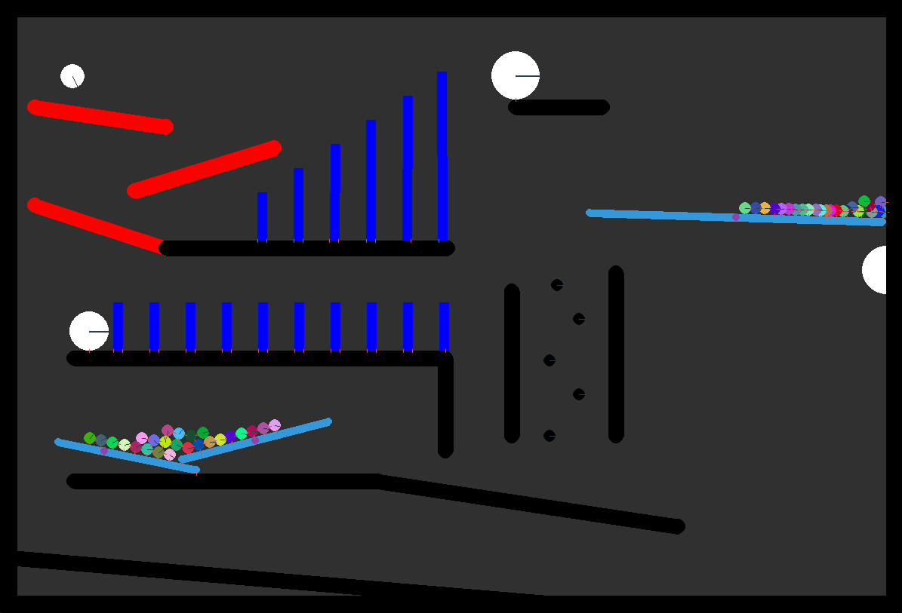

# Physics Simulation

A Rube Goldberg machine made with pymunk and pygame.



## Instructions

### Installation

Make sure you have Pygame installed.

```python
pip install pygame # install pygame with pip
```

Make sure you have Pymunk installed.

```python
pip install pymunk # install pymunk with pip
```

Now sit back and watch the simulation play.
